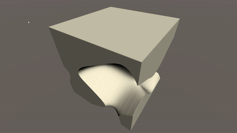
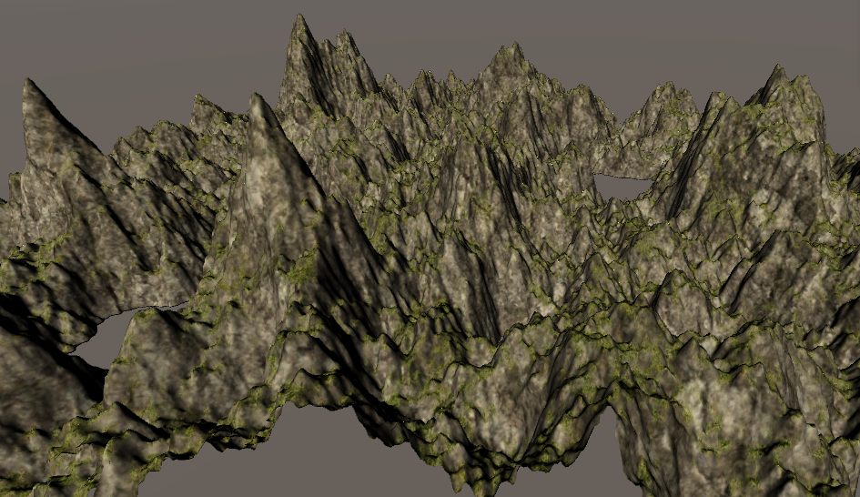

# CG
Tasks and lectures for CG course

# Assignments
- [Assignment 1, "Broken Shader"](./Lectures/Lecture1). _**due: 18.09.2019, 23:59**_
- [Assignment 2, "Marching Cubes"](./Lectures/Lecture2). _**due: 25.09.2019, 23:59**_

    Best results so far: 10 FPS @ 512 split ratio by each dimension
    
    
- [Assignment 3, "Triplanar Shading"](./Lectures/Lecture3). _**due: 02.10.2019, 23:59**_

    Upgraded 2 with triplanar shading and moved from noise to cycled terrain.

    Also noise is now cached at the start thus allowing 40 FPS @ 512 split ratio (or it is because of flat terrain instead of whole \[0,1\]^3 cube noise):

    